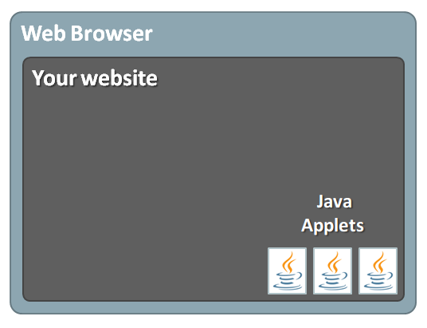
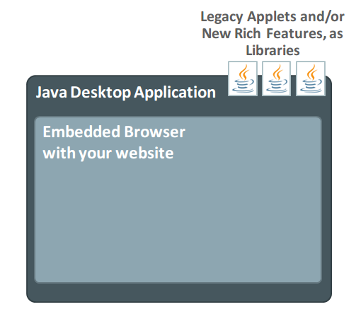
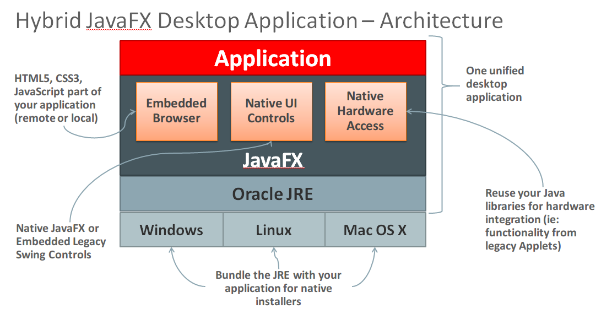

WebFX
=====
The purpose of this project is to investigate both the possibility of building a JavaFX-based web browser, as well a new concept of web pages designed using JavaFX components (by coding and serving remotely FXML + JS + CSS files) to build rich web pages, instead of using HTML. With the new Javascript engine, *Nashorn*, the performance of a JavaFX page in FXML and the controllers in JS will be much higher than it is today. The goal of this project is to build a fully capable JavaFX-based browser, with a security layer, a navigation scheme, and then common web browser features such as bookmarking, cookie management, etc.

## Inverted Browser Control Concept
JavaFX contains a feature called WebView, which enables applications to use an embedded version of WebKit to render HTML5 content. As a result, developers can create applications that use this browser to access remote applications. By combining this concept, developers can continualy build web applications that may have extensions built in Java to be executed in the client-side, as long these Java-based extensions are part of a JavaFX desktop application.

**Figure 1** represents the legacy of Applets and Web Browsers. It is well known that Applets are no longer supported by all browsers, and that NPAPI is being slowly removed.

 

**Figure 2** representes the inverted browser control concept, where developers build their own "embedded" browser to run remotely served web applications, while expanding the capability of their desktop applications in the client-side with rich features using JavaFX, or even reusing existing Applets codebases.

 

## Running Applets in a JavaFX-based browser
The WebView component does not support the execution of Applets out-of-the-box. Graphical embedded applets (those that would show within a web page) are impossible to run, but for non-graphical Applets it is possible to load them and even have them interacting with your web page's Javascript code. For an example of such use case, see project [webfx-appletsupport-sample](webfx-appletsupport-sample/) for more information.

## JavaFX-based Web Browser
FXML is the JavaFX markup language used to define user interfaces. UI components can be any JavaFX core component or any 3rd-party component available in the classpath. JavaFX also supports CSS for styling the UI. A web browser powered by JavaFX is then capable of running both regular W3C web pages as well FXML-based web pages remotely served.

### YouTube Demo Videos
 - [WebFX Overview and Demo on RaspberryPi](https://www.youtube.com/watch?v=bzmdkjnbFkI)
 - [WebFX browser inside WebFX demo](https://www.youtube.com/watch?v=2LUF7lgpKLg#t=11)

## Hybrid JavaFX Application Architecture
The image below gives developers an idea on how they can leverage existing code, both legacy Applets, and web applications, with modern development approaches of JavaFX Desktop RIA applications. 

